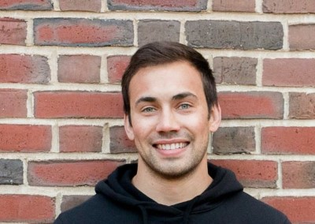

    
<!---

-->

I'm a graduate student in department of <a href="https://pbs.dartmouth.edu//"><b>Psychological and Brain Sciences</b></a> at Dartmouth College working with Dr. Meghan Meyer in the <a href="http://www.dartmouth-socialneurolab.com/"><b>Dartmouth Social Neuroscience Lab</b></a>. In my research, I use data collected passively through smartphones to better understand aspects of mental health and personality. 

Before Dartmouth, I graduated from Iowa State University with a major in psychology and a minor in statistics. While at Iowa State, I also completed a NSF <a href="https://www.nsf.gov/awardsearch/showAward?AWD_ID=1156522"><b>REU</b></a> (National Science Foundation Research Experience for Undergraduates) at the University of South Carolina studying the neural representation of social emotions (e.g., pride, shame, guilt, and embarassment).

<!---
[Resume](https://dasilvaa10.github.io/assets/resume.pdf)

-->