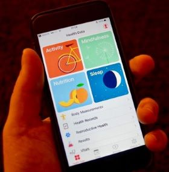

<!---

### Mobile Sensing and Individual Differences

One component of my research utilizes continuous mobile sensing to better understand factors related to mental health and personality. This work is done in conjunction with Dr. Andrew Campbell's <a href="http://dartnets.cs.dartmouth.edu/"><b>research group</b></a> who created the <a href="http://studentlife.cs.dartmouth.edu/"><b>StudentLife App</b></a>.  Together, our research groups have examined continuous sensing factors related to <a href="http://studentlife.cs.dartmouth.edu/a43-Wang.pdf"><b>depression</b></a>, <a href="https://mhealth.jmir.org/2019/3/e12084/"><b>stress</b></a>, and used <a href="https://static1.squarespace.com/static/57265384b09f951c90d0fed2/t/5dbb74d3e62ee56117eadfe9/1572566228810/DaSilva+-+Stress+and+Social+Interaction.pdf"><b>network models</b></a> to better understand how stress impacts subsequent behavior, particularly social behavior.

 
 

### Brain and Behavior

The second line of my research seeks to better understand the relationship between brain (measured with functional neuroimaging) and behavior (measued objectively with passive sensing). Our group has conducted pilot work linking <a href="https://www.frontiersin.org/articles/10.3389/fnins.2019.00248/full"><b>passive sensing features to brain imaging data</b></a>. In progress are projects using predictive modeling and analytic techniques for intensively collected longituindal data to further understand the interplay between these two data modalities.

 -->

### Mobile Sensing and Individual Differences

One component of my research utilizes continuous mobile sensing to better understand factors related to mental health and personality. This work is done in conjunction with Dr. Andrew Campbell's <a href="http://dartnets.cs.dartmouth.edu/"><b>research group</b></a> who created the <a href="http://studentlife.cs.dartmouth.edu/"><b>StudentLife App</b></a>.  Together, our research groups have examined continuous sensing factors related to <a href="http://studentlife.cs.dartmouth.edu/a43-Wang.pdf"><b>depression</b></a>, <a href="https://mhealth.jmir.org/2019/3/e12084/"><b>stress</b></a>, and used <a href="https://static1.squarespace.com/static/57265384b09f951c90d0fed2/t/5dbb74d3e62ee56117eadfe9/1572566228810/DaSilva+-+Stress+and+Social+Interaction.pdf"><b>network models</b></a> to better understand how stress impacts subsequent behavior, particularly social behavior.

### Brain and Behavior

The second line of my research seeks to better understand the relationship between brain (measured with functional neuroimaging) and behavior (measued objectively with passive sensing). Our group has conducted pilot work linking <a href="https://www.frontiersin.org/articles/10.3389/fnins.2019.00248/full"><b>passive sensing features to brain imaging data</b></a>. In progress are projects using predictive modeling and analytic techniques for intensively collected longituindal data to further understand the interplay between these two data modalities.

